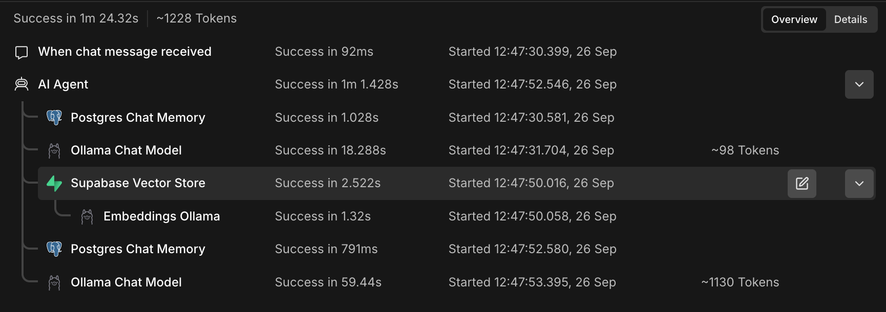
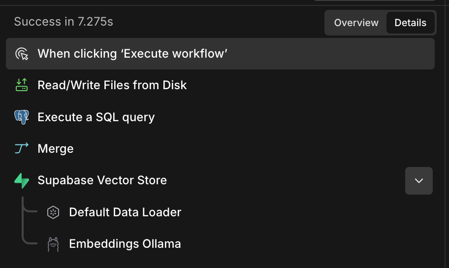

# Local RAG

A practical Retrieval-Augmented Generation (RAG) project built with **n8n, Ollama, Supabase/pgvector, and Python**.

The project explores a complete RAG pipeline with local AI inference, document ingestion, vector retrieval, and conversational memory.

## Stack

- **n8n** — workflow orchestration and AI Agent
- **Ollama** — local LLM inference and embeddings
- **Supabase / PostgreSQL / pgvector** — vector storage, similarity search, and chat memory
- **Python** — local Ollama experimentation
- **Docker / Colima** — local n8n environment on macOS

## Architecture

The AI components run locally, while Supabase provides the persistent cloud database layer.

**Local:**

- Ollama and AI models
- n8n
- Docker / Colima
- Python
- Source documents

**Cloud:**

- Supabase PostgreSQL
- pgvector
- Document chunks and embeddings
- Chat memory

See [ARCHITECTURE.md](ARCHITECTURE.md) for the technical architecture and workflows.

## Current Status

The core RAG workflow is working end-to-end.

- [x] Local n8n in Docker/Colima
- [x] Local Ollama inference and embeddings
- [x] Supabase PostgreSQL + pgvector
- [x] PDF ingestion and text splitting
- [x] Vector retrieval through Supabase
- [x] AI Agent retrieval tool
- [x] PostgreSQL chat memory
- [x] Multiple-document knowledge base
- [x] Safe re-ingestion without duplicate vectors
- [x] End-to-end RAG question answering

The workflow has been tested with multiple documents, re-ingestion, vector retrieval, and conversational memory.

## Workflow Screenshots

### RAG Chat



### Document Ingestion



## Local AI

The current chat model is `qwen3:1.7b`.

Embeddings use `nomic-embed-text`, which produces **768-dimensional vectors**.

Ollama handles both generation and embedding locally. No external LLM API is required.

Other local models were tested during development to compare performance. See [ARCHITECTURE.md](ARCHITECTURE.md) for the measurements.

## Project Structure

```text
rag/
├── app/
│   └── main.py
├── documents/
├── n8n/
│   └── data/
├── .venv/
├── docker-compose.yml
├── requirements.txt
├── .gitignore
├── README.md
└── ARCHITECTURE.md
```

The `documents/` directory contains local knowledge-base files and is excluded from Git.

## Running Locally

Start Colima:

```bash
colima start --port-forwarder=grpc
```

Start n8n:

```bash
docker compose up -d
```

Start Ollama:

```bash
ollama serve
```

Open n8n:

```text
http://localhost:5678
```

Check installed/running models:

```bash
ollama list
ollama ps
```

## Documentation

- [ARCHITECTURE.md](ARCHITECTURE.md) — technical architecture, workflows, data flow, networking, and implementation details
