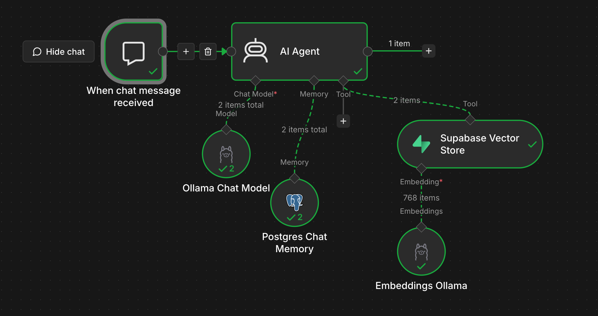
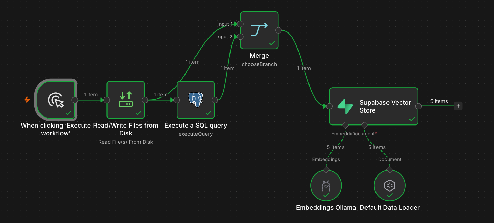
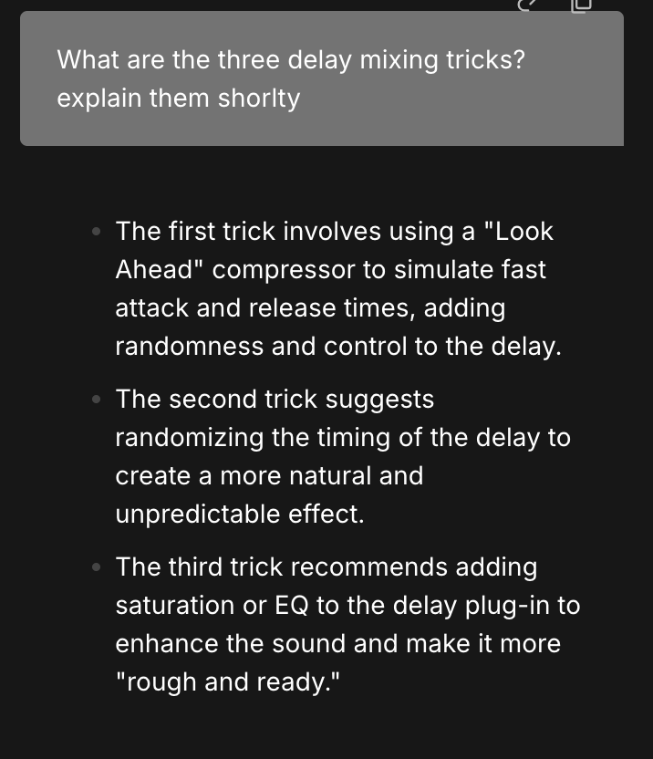

# Local RAG

A Retrieval-Augmented Generation (RAG) system built with **n8n, Ollama, and Supabase/pgvector**.

It ingests PDF documents into a vector database and answers questions about them through a chat interface, using local AI models for both generation and embeddings, plus conversational memory.

## Stack

- **n8n**: workflow orchestration and AI Agent
- **Ollama**: local LLM inference and embeddings
- **Supabase / PostgreSQL / pgvector**: vector storage, similarity search, and chat memory
- **Docker / Colima**: local n8n environment on macOS

## Architecture

AI inference runs locally. Supabase is cloud-hosted and provides the persistent database layer.

**Local:**

- Ollama and AI models
- n8n (Docker / Colima)
- Source documents

**Cloud (Supabase):**

- PostgreSQL + pgvector
- Document chunks and embeddings
- Chat memory

See [ARCHITECTURE.md](ARCHITECTURE.md) for the technical architecture and workflows.

## Features

- Local LLM inference and embeddings with Ollama (no external LLM API)
- PDF ingestion, text splitting, and embedding into Supabase pgvector
- Source metadata on every chunk (the PDF filename)
- Safe re-ingestion: existing chunks for a document are deleted before it is re-inserted, so there are no duplicate vectors
- Multiple documents in one knowledge base, ingested one PDF per workflow run
- AI Agent that uses vector search as a retrieval tool
- PostgreSQL-backed chat memory
- End-to-end question answering over the ingested documents

## Screenshots

### RAG Chat workflow



### Document Ingestion workflow



### Example response



## Models

- Chat: `qwen3:1.7b`
- Embeddings: `nomic-embed-text` (**768-dimensional vectors**)

Other local models were compared during development. See [ARCHITECTURE.md](ARCHITECTURE.md#models) for the measurements.

## Project Structure

```text
rag/
├── workflows/
│   ├── rag-chat.json              # n8n chat workflow (AI Agent + retrieval + memory)
│   └── rag-ingest-documents.json  # n8n ingestion workflow
├── supabase/
│   └── schema.sql                 # pgvector extension, documents table, match_documents
├── pics/                          # screenshots
├── docker-compose.yml             # local n8n
├── README.md
└── ARCHITECTURE.md
```

`documents/` (source PDFs) and `n8n/data/` (n8n local state) are created locally and excluded from Git.

## Running Locally

Requirements: Ollama, Colima + Docker, and a Supabase project.

1. Pull the models and start Ollama:

   ```bash
   ollama pull qwen3:1.7b
   ollama pull nomic-embed-text
   ollama serve
   ```

2. Apply the database schema: run [`supabase/schema.sql`](supabase/schema.sql) in the Supabase SQL Editor.

3. Put the PDFs to ingest in a local `documents/` directory. It is mounted read-only into n8n at `/home/node/.n8n-files`.

4. Start Colima and n8n:

   ```bash
   colima start --port-forwarder=grpc
   docker compose up -d
   ```

   Open n8n at `http://localhost:5678`.

5. Import `workflows/rag-chat.json` and `workflows/rag-ingest-documents.json` (**Workflows → Import from File**).

6. Create the n8n credentials and select them in the workflow nodes:
   - **Ollama**: base URL `http://host.docker.internal:11434`
   - **Supabase API**: project URL and service role key
   - **Postgres**: Supabase database connection details (used for chat memory and for deleting old chunks during ingestion)

7. Ingest a document: in **RAG - Ingest Documents**, set the file path in the **Read/Write Files from Disk** node (for example `/home/node/.n8n-files/document.pdf`) and execute the workflow. Repeat for each document.

8. Ask questions: open **RAG - Chat** and use the n8n chat panel.
